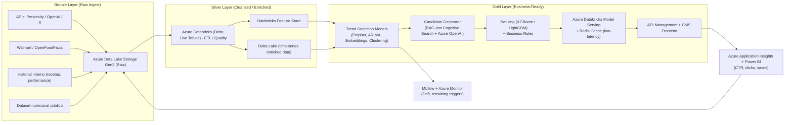

# freshFork – Sistema de Recomendación Proactivo

## 🔹 Arquitectura Propuesta (Azure + Databricks Medallion)

---

## 🔹 Detalle del Stack Propuesto

### Bronze Layer (Raw Ingest)

Este es el primer paso, en donde se guarda toda la información raw dentro de Azure datalake. Se toma el historial interno de receta, la información de las diferentes API (algunas de ellas podrían consultarse a tiempo real de ser necesario) y el data ser nutricional.

* **Azure Data Lake Storage Gen2 (ADLS)**: repositorio único para datos crudos.
* **Event Hubs / Kafka**: ingesta en tiempo real desde redes sociales y APIs.
* Fuentes: APIs de tendencias, ventas (Walmart/OpenFoodFacts), historial de recetas, dataset nutricional.

### Silver Layer (Cleansed / Structured)

Se hace una limpieza de la data, se transforma a los formatos requeridos y se aplican los diferentes tratamientos tanto para variables númericas como tipo texto. 

* **Databricks Delta Live Tables**: limpieza, validación y estandarización.
* **Databricks Feature Store**: centraliza features (crecimiento, embeddings, nutrición).
* **Delta Lake (time-series)**: series temporales enriquecidas para modelado.

### Gold Layer (Business-Ready)

Se empieza a trabajar en el producto como tal, se tiene un modelo encargado de encontrar los ingredientes cuya tendencia este incrementando (trend engine), otro modelo de NLP basado en tecnologías de Azure (candidatr generator) para la construcción de las recetas basadas en los ingredientes, una sección donde se aplican diferentes filtros y reglas de negocio a los resultados del anterior modelo (Ranking &Business Rules) y finalmente se sirve los resultados al usuario (Serving) 

* **Trend Engine**: modelos de series temporales (Prophet, ARIMA), embeddings (Azure OpenAI), clustering (UMAP, HDBSCAN).
* **Candidate Generator**: RAG con Azure Cognitive Search + Azure OpenAI para generar recetas nuevas basadas en tendencias.
* **Ranking & Business Rules**: XGBoost/LightGBM + reglas de negocio (nutrición, estacionalidad, diversidad).
* **Serving**: Model Serving en Databricks + Azure Cache for Redis para baja latencia; API Management + CMS para exposición.

### Monitoring & Analytics

* **MLflow**: experiment tracking y versiones de modelos.
* **Azure Monitor + Evidently AI**: detección de *drift* y triggers de reentrenamiento.
* **Application Insights + Power BI**: métricas de performance online (CTR, guardados, uplift).

---

## 🔹 Trade-offs, Supuestos y Riesgos

* **Cold-start problem**: nuevos ingredientes o recetas sin historial pueden recibir baja relevancia inicial → mitigado con popularidad global y señales sociales.
* **Sesgos en datos**: redes sociales pueden reflejar preferencias de nichos, no de la población general → se balancea con ventas en supermercados.
* **Freshness de datos**: tendencias cambian rápido, por lo que la latencia de ingesta debe ser baja (minutos/horas, no días). Requiere investigación de cambios de tendencias.
* **Costo y escalabilidad**: uso intensivo de LLMs (Azure OpenAI) puede elevar costos; se necesita caching y distillation.
* **Ruido en redes sociales**: hashtags artificiales o campañas de marketing pueden sesgar resultados → se aplican filtros y validaciones cruzadas con datos de ventas.

---

## 🔹 Plan de Experimentación

### Offline (validación inicial)

* **Precision / Recall**: exactitud de recomendaciones.
* **Novelty / Diversity**: innovación y variedad en las recetas.
* **Coverage**: porcentaje de ingredientes/recetas cubiertos.

### Online (A/B testing)

* **CTR uplift**: incremento en tasa de clics frente a baseline.
* **Engagement**: guardados, compartidos, comentarios.
* **Conversion**: adopción real de recetas sugeridas.
* **Retention uplift**: frecuencia de uso de la aplicación tras nuevas recomendaciones.

---

✅ Con esta arquitectura basada en Azure + Databricks Medallion se logra:

* Escalabilidad para streaming + batch.
* Reproducibilidad (Feature Store + MLflow).
* Creatividad controlada (RAG + LLMs).
* Ciclo cerrado de mejora continua con feedback de usuarios.

