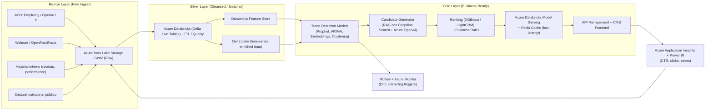

# Ejemplo practico del reto Dataton 2022

# freshFork – Sistema de Recomendación Proactivo

## 🔹 Arquitectura Propuesta (Azure + Databricks Medallion)

---

## 🔹 Detalle del Stack Propuesto

### Bronze Layer (Raw Ingest)

* **Azure Data Lake Storage Gen2 (ADLS)**: repositorio único para datos crudos.
* **Event Hubs / Kafka**: ingesta en tiempo real desde redes sociales y APIs.
* Fuentes: APIs de tendencias, ventas (Walmart/OpenFoodFacts), historial de recetas, dataset nutricional.

### Silver Layer (Cleansed / Structured)

* **Databricks Delta Live Tables**: limpieza, validación y estandarización.
* **Databricks Feature Store**: centraliza features (crecimiento, embeddings, nutrición).
* **Delta Lake (time-series)**: series temporales enriquecidas para modelado.

### Gold Layer (Business-Ready)

* **Trend Engine**: modelos de series temporales (Prophet, ARIMA), embeddings (Azure OpenAI), clustering (UMAP, HDBSCAN).
* **Candidate Generator**: RAG con Azure Cognitive Search + Azure OpenAI para generar recetas nuevas basadas en tendencias.
* **Ranking & Business Rules**: XGBoost/LightGBM + reglas de negocio (nutrición, estacionalidad, diversidad).
* **Serving**: Model Serving en Databricks + Azure Cache for Redis para baja latencia; API Management + CMS para exposición.

### Monitoring & Analytics

* **MLflow**: experiment tracking y versiones de modelos.
* **Azure Monitor + Evidently AI**: detección de *drift* y triggers de reentrenamiento.
* **Application Insights + Power BI**: métricas de performance online (CTR, guardados, uplift).

---

## 🔹 Plan de Experimentación

### Offline (validación inicial)

* **Precision@k / Recall@k**: exactitud de las recomendaciones.
* **Novelty / Diversity**: grado de innovación y variedad en las recetas.
* **NDCG (Normalized Discounted Cumulative Gain)**: ranking de relevancia.

### Online (A/B testing)

* **CTR uplift**: comparación entre recomendaciones actuales vs. modelo propuesto.
* **Engagement**: guardados, compartidos, comentarios.
* **Conversion**: adopción real de nuevas recetas sugeridas.

---

✅ Con esta arquitectura basada en Azure + Databricks Medallion se logra:

* Escalabilidad para streaming + batch.
* Reproducibilidad (Feature Store + MLflow).
* Creatividad controlada (RAG + LLMs).
* Ciclo cerrado de mejora continua con feedback de usuarios.
